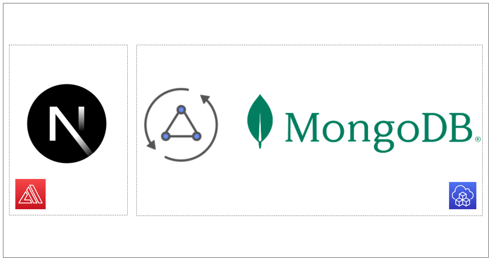
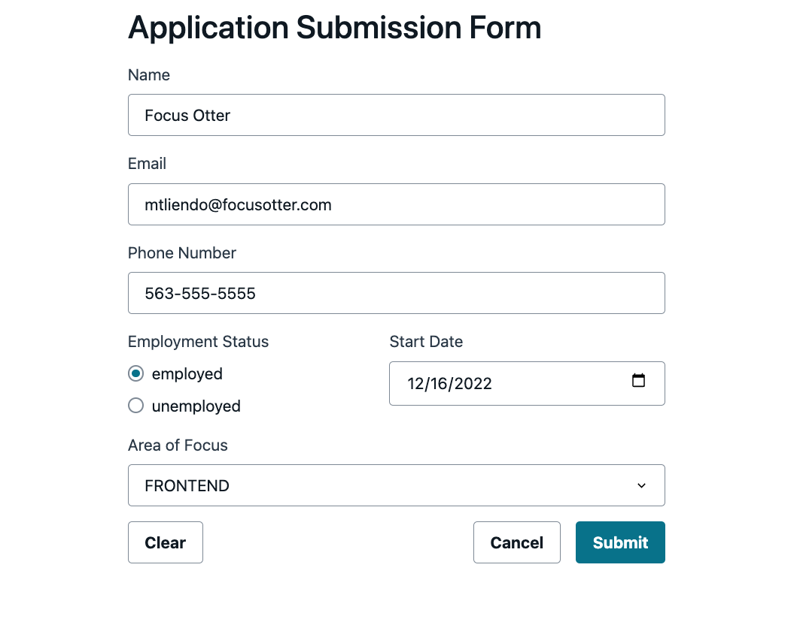

# The fullstack guide to using AWS AppSync and MongoDB

> NextJS, AWS CDK, AWS Amplify, JavaScript pipeline resolvers




> This project is used in the following blog post:

This repo is made up of two projects. A frontend, and a backend.

## Backend Overview

Using AWS AppSync's pipeline resolvers (written in JavaScript), a request is made to AWS Secrets Manager. This request grabs the API Key needed for MongoDB. Once successful, an API request is made to MongoDB.

The backend services are provisioned using the CDK. Currently, the L2 constructs available for AppSync are in preview and don't yet support JavaScript resolvers. To accomplish this, I use an escape hatch to drop down to the L1 construct. This results in parts of the code being a bit verbose:

```js
// Create a function that gets the secret
  const getMongoSecretFunc = new appsync.AppsyncFunction(
    this,
    'getMongoSecretFunc',
    {
      api,
      dataSource: secretsManagerDS,
      name: 'getMongoSecretFromSSM',
    }
  )

  // Escape hatch to access L1 construct
  const cfnGetMongoSecretFunc = getMongoSecretFunc.node
    .defaultChild as CfnFunctionConfiguration

  cfnGetMongoSecretFunc.runtime = {
    name: 'APPSYNC_JS',
    runtimeVersion: '1.0.0',
  }

  cfnGetMongoSecretFunc.code = readFileSync(
    path.join(__dirname, '/graphql/mappings/getMongoSecret.js'),
    'utf-8'
  )
```

But once the L2 constructs are updated, I'll update this repo accordingly.

## Frontend Overview

The frontend is a NextJS application and makes use of the the following features of Amplify:

- Amplify Libraries: Connect our frontend to our backend
- Amplify CLI: To autogenerate our GraphQL queries and mutations
- Amplify UI Components: To display our UI components on the screen
- Amplify Studio Form Builder: A free GUI to create our form, no AWS account needed

## Installation and Deployment

Once this repo is cloned, change into both folders and run the following command:

```bash
npm install
```

To deploy the backend solution,

Add your MongoDB API key to AWS Secrets Manager (refer to blog post for instructions if unfamiliar). Once done, in the `bin` directory of the backend project, change the value for the `MONGO_SECRET_ARN` to be the ARN of your secret.

Once done, run the following command:

`npx aws-cdk deploy`

This will synthesize your resources down to cloudformation, build your assets, and deploy the project to AWS.

For the frontend, once installed, run the command:

```bash
npm run dev
```

This will run the project locally. To host this application on the web, refer to the Amplify Hosting docs or my previous post on [deploying a NextJS application with the CDK](https://aws.amazon.com/blogs/mobile/deploy-a-nextjs-13-application-to-amplify-with-the-aws-cdk/)

## Extras

This repo also contains a query to list all the applicants in a MongoDB Cluster. This includes pagination support via the `skip` and `limit` options. The UI isn't configured to do this, but consider it a nice challenge if wanting to test your knowledge.

## Contributing

Definitely feel free to file an issue before submitting a PR to make sure work isn't duplicated.
